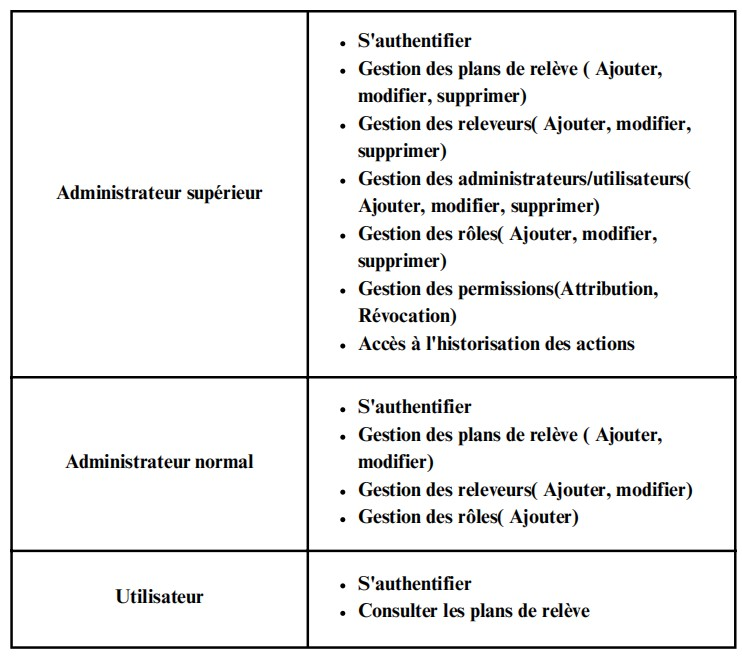
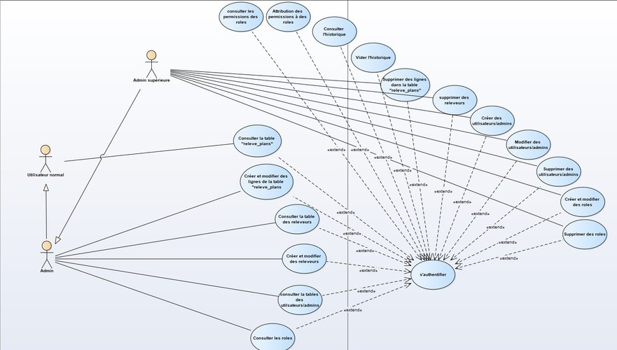
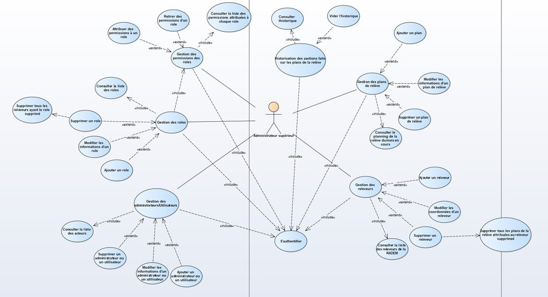
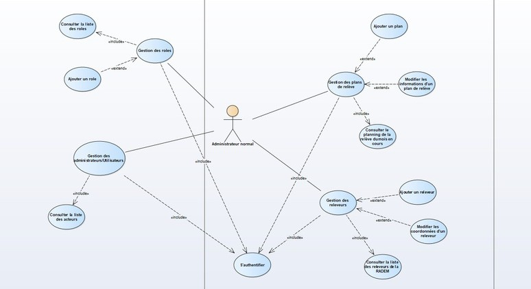
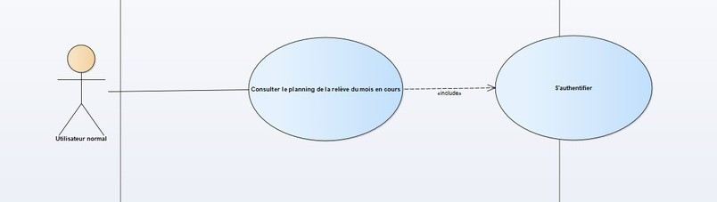
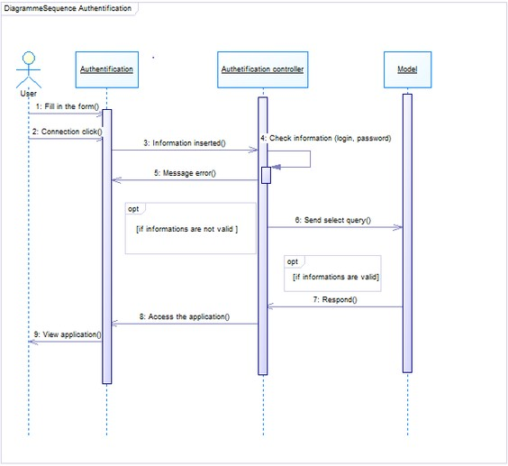
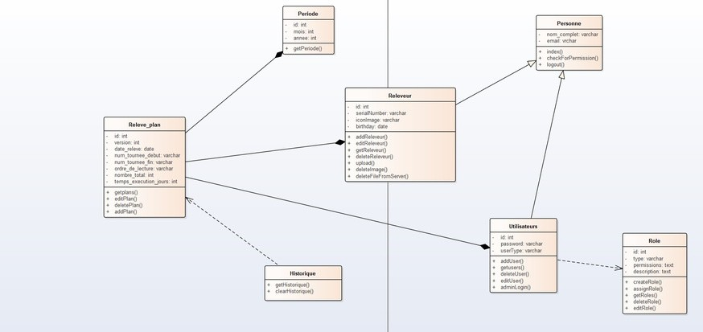

# Electricity And Water Meter Reading Scheduling

I've developed a SPA for managing meter reading schedules to optimize operations related to meter reading. By using Vue.js and Laravel, I've built an interactive and responsive user interface, along with advanced database management. Following the Merise methodology, I ensured a clear and structured modeling of data and processes. Now, Admins can easily view the current month's meter readings, and I've implemented a flexible and dynamic access control system. Overall, I designed this application to provide a user-friendly solution that perfectly meets the specific needs of the company RADEM where i did my 2 months Intership

## Roadmap

- System Actors
- Design/Modeling
    - Use Case diagrams
    - Sequence Diagram
    - Class Diagram
- Installation
- Usage
- License

## System Actors



## Design / Modeling

### Use Case Digrams
#### General System




#### Superior Admin



#### Normal Admin



#### Normal User



### Sequence Digram



### Class Digrams



## Installation

To run this project locally, follow these steps:

1. Clone this repository.
2. Navigate to the project directory.
3. Install dependencies:
For frontend:
```bash
  npm install
```
For backend:
```bash
  composer install
```
4. Set up your environment variables.
5. Import the database script (if provided).
6. If you plan to run both frontend and backend servers concurrently during development, install concurrently globally or as a dev dependency:

```bash
npm install -g concurrently
```
7. Run the following commands to compile assets and start the development servers:
```bash
  npm run dev
```


## Usage

Once the project is set up and the development servers are running, you can access the application by opening your web browser and navigating to the appropriate URL. Typically, this will be http://localhost:8000 for the Laravel backend and http://localhost:8080 for the Vue.js frontend.

## Tech Stack

**Client:** Vue, Bootstrap

**Server:** Laravel, MySQL

## License

[MIT](https://choosealicense.com/licenses/mit/)


