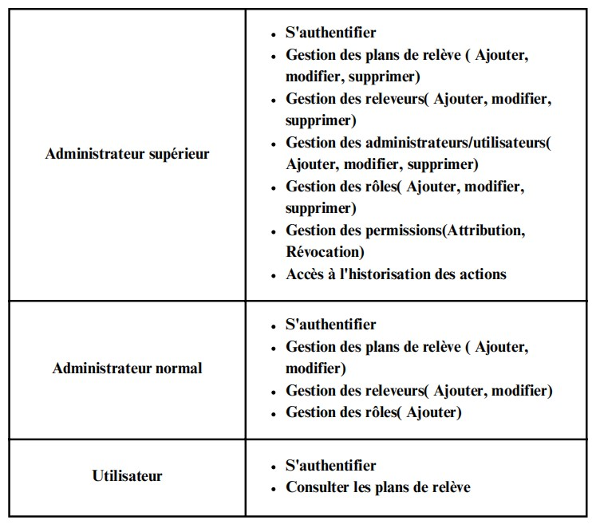
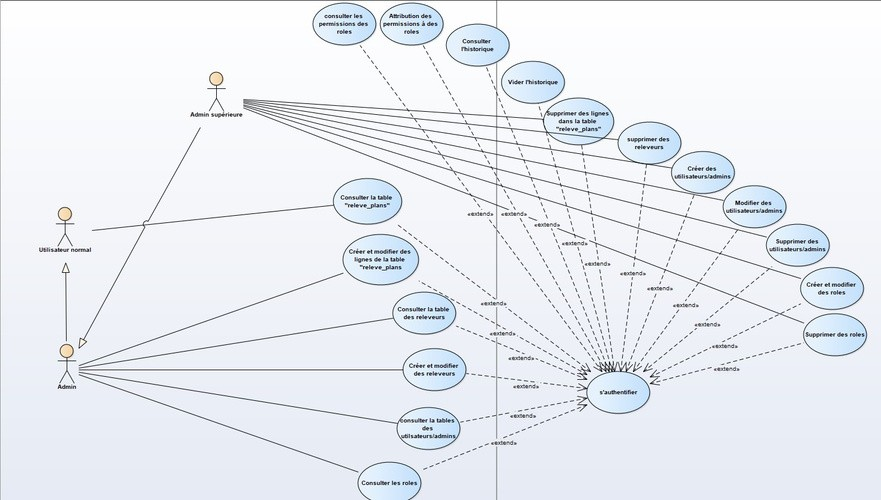
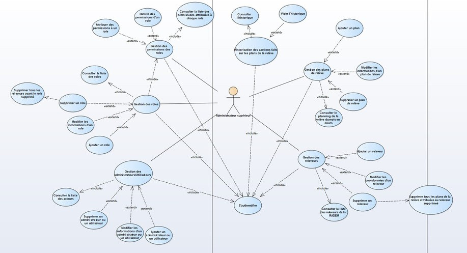
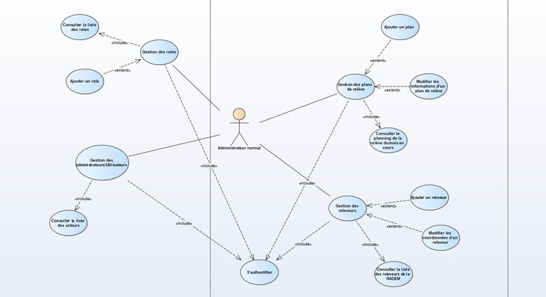
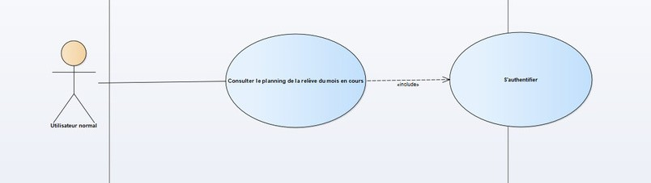
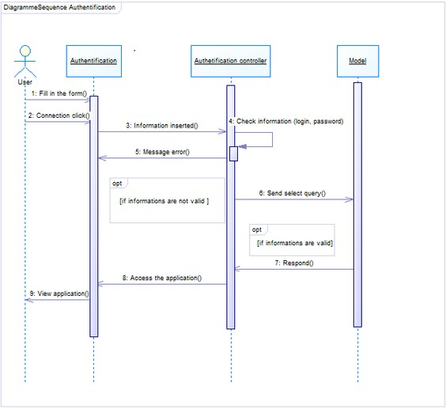
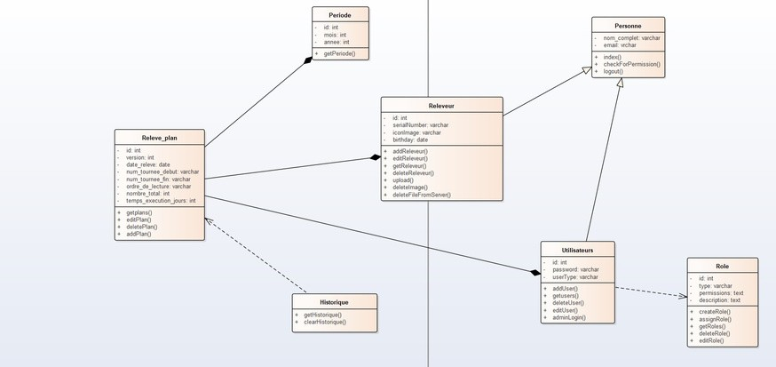

<div align="center">

# Gestion des Relevés de Compteurs Eau & Électricité

Application SPA de planification et de suivi des relevés de compteurs, développée durant un stage de 2 mois chez **RADEM**.


</div>

## Sommaire

- [Aperçu](#aperçu)
- [Fonctionnalités](#fonctionnalités)
- [Stack technique](#stack-technique)
- [Acteurs du système](#acteurs-du-système)
- [Conception / Modélisation](#conception--modélisation)
- [Installation](#installation)
- [Utilisation](#utilisation)
- [Licence](#licence)

## Aperçu

Ce projet a pour but de digitaliser et d'optimiser la planification des relevés de compteurs d'eau et d'électricité. Développée avec **Vue.js** en frontend et **Laravel** en backend, l'application propose une interface interactive et responsive, appuyée par une modélisation des données et des processus suivant la méthode **Merise**.

Les administrateurs peuvent consulter les relevés du mois en cours, gérer les plannings des releveurs, et l'accès aux différentes fonctionnalités est contrôlé par un système de rôles dynamique et flexible. L'application a été pensée pour répondre précisément aux besoins opérationnels de RADEM.

## Fonctionnalités

- Planification et suivi des tournées de relevé
- Tableau de bord admin avec vue mensuelle des relevés
- Système de rôles et permissions dynamique (Super Admin, Admin, Releveur, Utilisateur)
- Historique des relevés par compteur
- Interface SPA réactive (Vue Router + Vuex)
- Authentification API via Laravel Sanctum

## Stack technique

| Côté | Technologies |
| --- | --- |
| **Frontend** | Vue 3, Vue Router, Vuex, Bootstrap 5, Tailwind CSS |
| **Backend** | Laravel 10, PHP 8.1, Laravel Sanctum |
| **Base de données** | MySQL |

## Acteurs du système



## Conception / Modélisation

### Diagrammes de cas d'utilisation

#### Système global



#### Super Admin



#### Admin



#### Utilisateur



### Diagramme de séquence



### Diagramme de classes



## Installation

Prérequis : PHP 8.1 ou 8.2 pour les dépendances verrouillées, Composer, Node.js/npm et MySQL. Le fichier `composer.lock` actuel contient des dépendances incompatibles avec PHP 8.3.

1. Cloner le dépôt :
   ```bash
   git clone https://github.com/Abdelkrim7Be/Water-and-Electricity-Meter-Reader-Management-System.git
   ```
2. Se placer dans le dossier du projet.
3. Installer les dépendances :

   Frontend :
   ```bash
   npm install
   ```

   Backend :
   ```bash
   composer install
   ```
4. Copier la configuration locale :
   ```bash
   cp .env.example .env
   ```
   Dans `.env`, utiliser `DB_DATABASE=releve` et les identifiants de votre serveur MySQL :
   ```dotenv
   DB_HOST=127.0.0.1
   DB_PORT=3306
   DB_DATABASE=releve
   DB_USERNAME=root
   DB_PASSWORD=
   ```
   Laisser `DB_PASSWORD` vide si MySQL n'a pas de mot de passe, ou mettre `DB_PASSWORD=root` si le mot de passe local est `root`.
   Après une modification de `.env`, vider le cache de configuration avec `php artisan config:clear`.
5. Générer la clé d'application :
   ```bash
   php artisan key:generate
   ```
6. Pour une nouvelle installation, créer une base vide et importer les données factices :
   ```bash
   mysql -h 127.0.0.1 -u root -p -e "CREATE DATABASE releve CHARACTER SET utf8mb4 COLLATE utf8mb4_unicode_ci;"
   mysql -h 127.0.0.1 -u root -p releve < releve.sql.example
   ```
   À l'invite, saisir le mot de passe MySQL (ou appuyer sur Entrée s'il est vide).
   Ne pas importer ce fichier dans une base déjà utilisée. Les mots de passe des comptes d'exemple sont des valeurs factices : définir un mot de passe local avant de se connecter.
7. Compiler les assets et démarrer Laravel (`concurrently` est déjà inclus dans les dépendances npm) :
   ```bash
   npm run dev
   ```

## Utilisation

Ouvrir **http://localhost:8000**. Laravel sert aussi l'interface Vue.js ; `npm run dev` compile les assets avec Laravel Mix et démarre le serveur PHP.

Pour recompiler automatiquement les assets pendant les modifications, lancer `npm run watch` dans un autre terminal.

Si MySQL refuse la connexion, vérifier les mêmes identifiants avec `mysql -h 127.0.0.1 -u root -p`, puis corriger `.env` et exécuter `php artisan config:clear`.

## Licence

Distribué sous licence [MIT](LICENSE).
