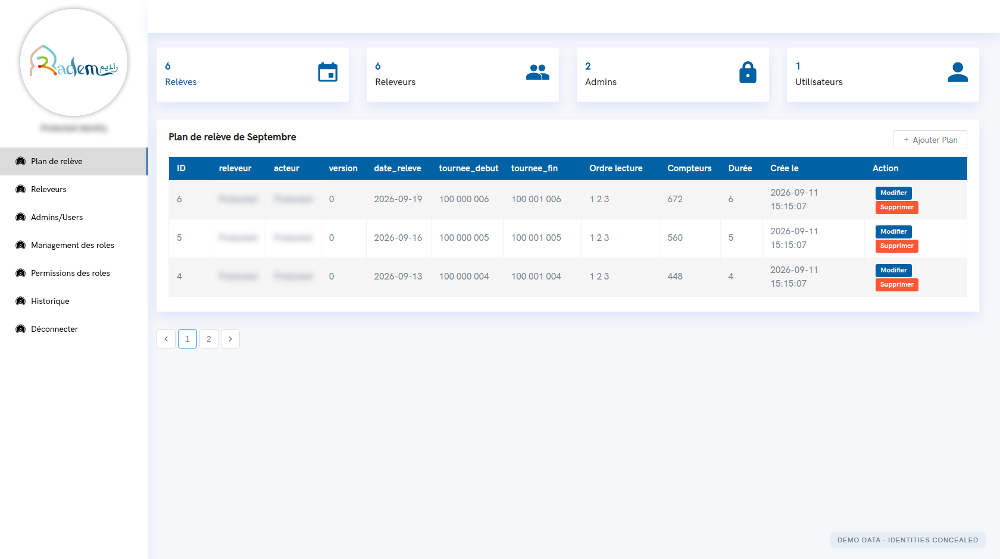
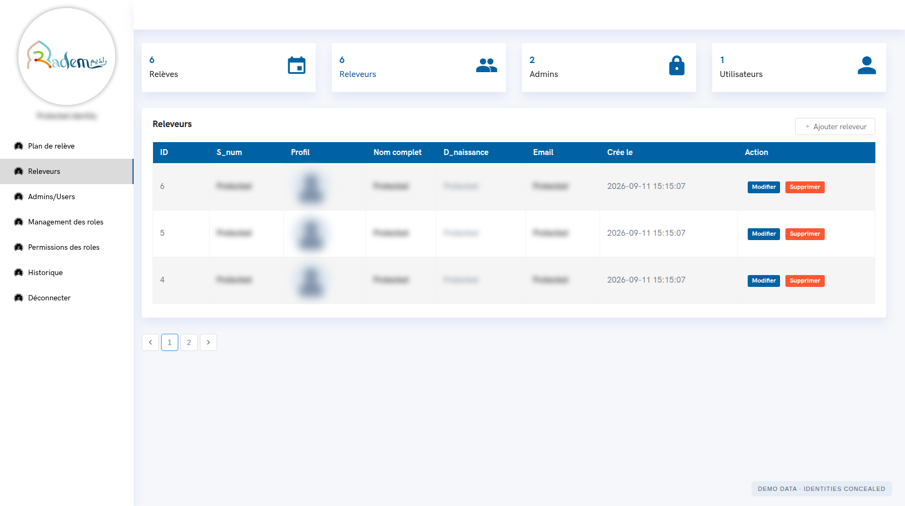
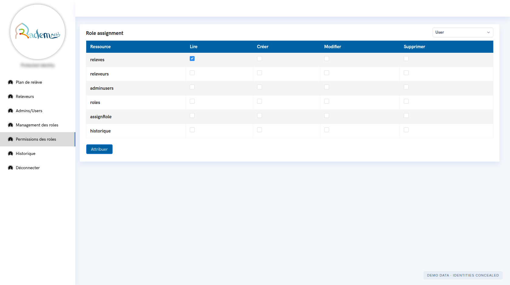
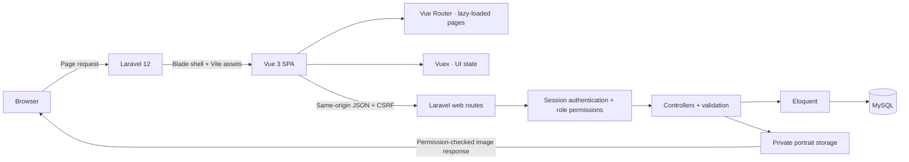

<div align="center">

# Meter Reading Management

Plan and manage water and electricity meter-reading operations, with reader assignments, role-based access, and activity history.

[](https://github.com/Abdelkrim7Be/Water-and-Electricity-Meter-Reader-Management-System/actions/workflows/ci.yml)
[](LICENSE)


[Overview](#overview) · [Screenshots](#screenshots) · [Architecture](#architecture) · [Local setup](#local-setup) · [Checks](#checks)

</div>

## Overview

A French-language application for organizing meter-reading rounds: assign field readers, define reading periods and route ranges, track planned workloads, and review changes. Administrators manage accounts and configure read, create, update, and delete permissions for each resource.

The project began during a two-month internship at **RADEM**, using Merise for the original analysis and modeling. This repository contains the application source, a reproducible synthetic demo, tests, and deployment notes.

## Features

| Area | Capabilities |
| --- | --- |
| Planning | Reader assignments, dates, route ranges, reading order, estimated meter counts, and duration |
| Field readers | Reader directory, contact details, portraits, and related plans |
| Accounts | Administrator and viewer accounts linked to configurable roles |
| Permissions | Resource-level permissions enforced by Laravel and reflected in the interface |
| History | Creation, modification, and deletion history for reading plans |
| Dashboard | Aggregate record counts and paginated management screens |

## Screenshots

Captured from the running application using a separate database containing **synthetic records only**. Identity fields are replaced and blurred before capture; portraits use a blurred generic avatar. [Capture procedure](docs/screenshots/README.md).

**Reading plans:** monthly assignments, workload, and route ranges.



<details>
<summary><strong>Reader directory and role permissions</strong></summary>

**Reader directory:** personal fields and portraits concealed.



**Role permissions:** configure access to each management area.



</details>

## Architecture


```mermaid
flowchart LR
    Browser[Browser] -->|Page request| Laravel[Laravel 12]
    Laravel -->|Blade shell + Vite assets| SPA[Vue 3 SPA]
    SPA --> Router[Vue Router · lazy-loaded pages]
    SPA --> Store[Vuex · UI state]
    SPA -->|Same-origin JSON + CSRF| Routes[Laravel web routes]
    Routes --> Access[Session authentication + role permissions]
    Access --> Controller[Controllers + validation]
    Controller --> ORM[Eloquent]
    ORM --> DB[(MySQL)]
    Controller --> Files[Private portrait storage]
    Files -->|Permission-checked image response| Browser
```

Laravel serves the page shell and JSON endpoints from the same origin. Authentication uses Laravel sessions and CSRF protection; Sanctum is installed for API-token integration. The current SPA uses session cookies. Vite builds production assets and provides hot reload during development.

The data model centers on **roles → users**, **readers → reading plans**, **periods → reading plans**, and **plans → history**. Some legacy relationships use reader serial numbers and actor names rather than foreign-key IDs. See [architecture and deployment notes](docs/architecture.md) for the boundaries and limitations, and [original design diagrams](docs/design.md) for the internship modeling.

```text
app/                    Controllers, middleware, models, and Artisan commands
config/                 Application configuration
resources/js/           Vue pages, shared components, router, and store
resources/css/          Source styles
resources/views/        Blade page shell
routes/                 HTTP routes
database/schema/       MySQL baseline without personal records
tests/                 Authentication and security regression tests
docs/                  Architecture, modeling, and sanitized screenshots
.github/workflows/     Build, test, dependency, and secret checks
```

## Local setup

**Requirements:** PHP 8.3+ with PDO MySQL, mbstring, DOM, and fileinfo; Composer; Node.js 20.19+ or 22.12+; and MySQL 8. The current development setup was checked with PHP 8.3 and Node.js 20.

```bash
git clone https://github.com/Abdelkrim7Be/Water-and-Electricity-Meter-Reader-Management-System.git
cd Water-and-Electricity-Meter-Reader-Management-System
cp .env.example .env
composer install
npm ci
php artisan key:generate
```

Set the database connection in `.env`:

```dotenv
DB_CONNECTION=mysql
DB_HOST=127.0.0.1
DB_PORT=3306
DB_DATABASE=releve
DB_USERNAME=root
DB_PASSWORD=
```

Use the password configured on your own MySQL server. For a local installation using `root` as its password, set `DB_PASSWORD=root`; leave it empty only if the server accepts an empty password. After changing configuration, run `php artisan config:clear`.

For HTTPS deployment, set `APP_URL` to the HTTPS origin, set `CORS_ALLOWED_ORIGINS` to the exact allowed origins, and enable `SESSION_SECURE_COOKIE=true`. Do not use a wildcard CORS origin for authenticated deployments.

### New demo installation

Create an **empty** database, then initialize the schema and synthetic records:

```bash
mysql -h 127.0.0.1 -u root -p -e "CREATE DATABASE releve CHARACTER SET utf8mb4 COLLATE utf8mb4_unicode_ci;"
php artisan demo:setup
```

At the MySQL prompt, enter your database password, or press Enter if it is empty. `demo:setup` prints the demo admin email and a newly generated password. Save that password locally. There is no shared password committed to this repository.

The command only runs in `local` or `testing`, requires MySQL, and refuses a database that already contains tables. It loads the schema baseline and generates demo roles, users, readers, current-month plans, and history.

### Existing installation

Keep your database and existing `.env`. Install the updated dependencies, then migrate legacy portraits into private storage:

```bash
php artisan uploads:privatize
php artisan config:clear
npm run build
```

Do not run demo setup against existing operational data. See the [upgrade and deployment notes](docs/architecture.md#deployment-and-upgrades).

### Run the application

```bash
npm run dev
```

Open **http://localhost:8000**. This command starts Laravel and Vite; use Laravel's URL to access the app.

To serve a production build locally:

```bash
npm run build
php artisan serve
```

## Checks

```bash
php artisan test
composer validate --strict
composer audit
npm audit
npm run build
python3 scripts/check_repository.py
```

[CI](https://github.com/Abdelkrim7Be/Water-and-Electricity-Meter-Reader-Management-System/actions/workflows/ci.yml) also initializes an empty MySQL demo database, verifies that rerunning setup is rejected, checks configuration caching, and scans reachable Git history with Gitleaks. Dependency updates are monitored by Dependabot.

## Repository hygiene and performance

- Generated assets, dependencies, local configuration, logs, database exports, and uploaded files stay outside Git.
- Vite replaces the legacy Webpack/Mix toolchain; route pages are loaded on demand and production source maps are disabled.
- Dashboard counts come from aggregate queries instead of downloading account and reader records. Paginated endpoints accept at most 100 records per page.
- Portraits require authentication and read permission. Password hashes and recovery codes are excluded from user JSON.
- The demo contains no original user records or reusable credentials. Screenshots are reviewed separately from automated secret scanning.

For reporting concerns and handling previously exposed credentials, see [SECURITY.md](SECURITY.md). For changes to the project, see [CONTRIBUTING.md](CONTRIBUTING.md).

## License

Source code is distributed under the [MIT license](LICENSE). The RADEM name and logo identify the internship context; their inclusion does not imply endorsement or grant trademark rights.
