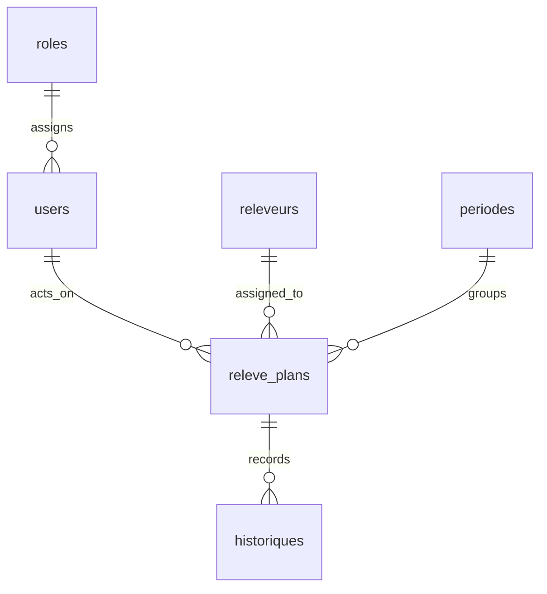

# Architecture and operations

## Request flow

1. Laravel serves the Blade shell. Vite supplies the Vue bundle and styles.
2. Vue Router loads management pages on demand; Vuex holds interface state and the current permission snapshot.
3. Axios sends same-origin requests to `/app/*`. Laravel's web middleware checks cookies, sessions, and CSRF tokens.
4. `AdminCheck` maps each controller action to a resource permission. Missing roles, invalid permission JSON, and unlisted actions are denied. Permission checks in Vue only control presentation.
5. Controllers validate input and query MySQL through Eloquent. File reads go through a permission-checked controller response.

The SPA uses session authentication. Laravel Sanctum is available as a dependency, but the application does not currently expose a separate token-based public API.

## Logical data model

This diagram describes logical relationships, not a guarantee of database-enforced foreign keys. The inherited model links some records using `fullName` and `serialNumber`. Renaming those identifiers and deleting associated records require care; migrating them to immutable IDs would be a separate schema change.

`database/schema/mysql-schema.sql` is a baseline of the inherited schema. It contains migration bookkeeping but no application records. The demo initializer imports this baseline and generates synthetic rows inside a transaction. MySQL DDL itself is not transactional: if schema import fails, diagnose the error before retrying in a new empty database.

## Files and generated assets

| Path | Purpose | Tracked |
| --- | --- | --- |
| `resources/` | Source code, styles, fonts, and illustrations | Yes |
| `public/build/` | Hashed Vite output | No |
| `storage/app/private/releveurs/` | Uploaded portraits | No |
| `.env` | Local secrets and connection settings | No |
| `database/schema/mysql-schema.sql` | Schema baseline | Yes |
| `docs/screenshots/` | Reviewed, synthetic, concealed captures | Yes |

Uploads accept JPEG/PNG images up to 2 MiB and 4096 × 4096 pixels. Filenames are generated UUIDs. The application rejects traversal paths; portraits are served at `/uploads/{filename}` only after authentication and the reader-directory read permission. The demo avatar is a source-controlled SVG, not an accepted upload format.

## Deployment and upgrades

- Point the web server's document root at `public/`. Keep `.env`, `storage/`, and database files outside the public document root.
- Use `APP_ENV=production`, `APP_DEBUG=false`, an HTTPS `APP_URL`, `SESSION_SECURE_COOKIE=true`, a unique `APP_KEY`, and a dedicated database account with the privileges the application actually needs.
- Set `CORS_ALLOWED_ORIGINS` to exact trusted origins. The application does not need wildcard origins for its same-origin SPA.
- Install PHP dependencies with `composer install --no-dev --optimize-autoloader`, and build assets with `npm ci && npm run build` in the build environment.
- Keep writable access limited to `storage/` and `bootstrap/cache/`. Cache configuration with `php artisan config:cache` after setting the environment.
- On an existing installation, run `php artisan uploads:privatize` before serving the updated app. It refuses destination filename conflicts. Back up the database and private uploads before upgrades.
- Ensure the web server forwards `/uploads/*` to Laravel and never serves legacy portrait files directly. The migration command removes those files from `public/uploads/`; verify the directory contains only `.gitkeep` afterward.
- Keep production credentials and backups outside this repository. `demo:setup` is deliberately unavailable in production.
- The current change does not rewrite the existing operational database or rotate existing account passwords. Rotate any credentials previously exposed publicly.

## Performance and limits

Dashboard totals use SQL counts rather than transferring all records. Lists are paginated and request sizes are bounded; reader selectors retrieve only the serial number and display name. Vite provides hashed assets, route-level code splitting, and builds without public source maps.

The shared View UI Plus component library remains the largest frontend bundle. The history table is an operational activity log, not a tamper-proof audit system: roles with its delete permission may clear it. Large-scale load testing, immutable-ID migration, backup/restore exercises, and production infrastructure hardening are outside the checks performed here.

## Upgrade references

The framework and asset changes follow the official [Laravel 11 upgrade guide](https://laravel.com/docs/11.x/upgrade), [Laravel 12 upgrade guide](https://laravel.com/docs/12.x/upgrade), and [Vite integration documentation](https://laravel.com/docs/12.x/vite).
